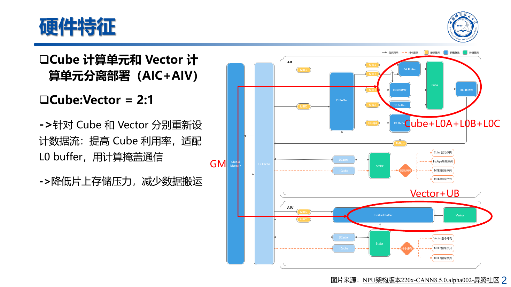
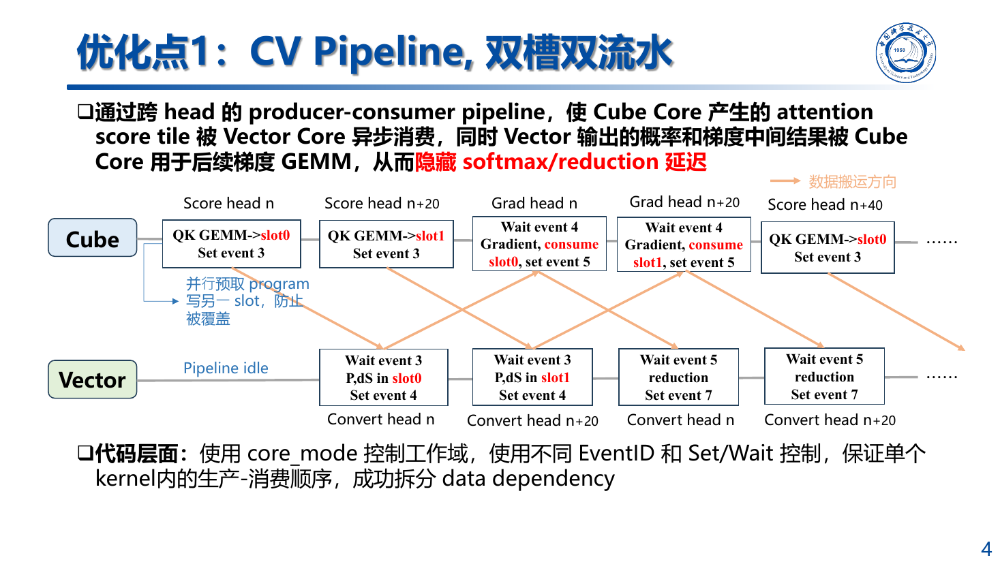
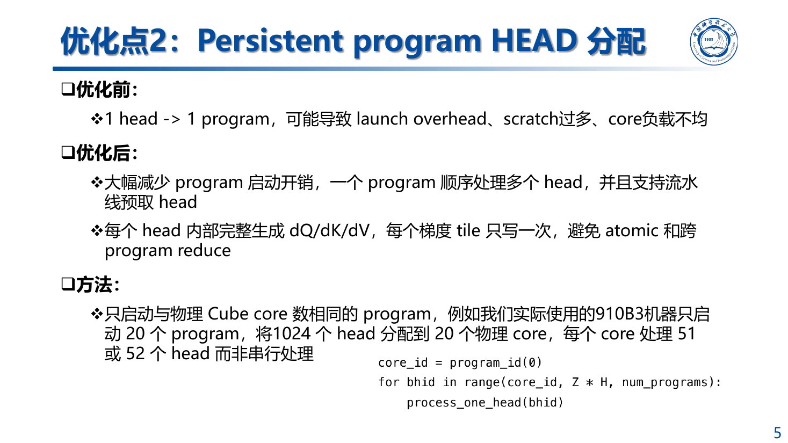
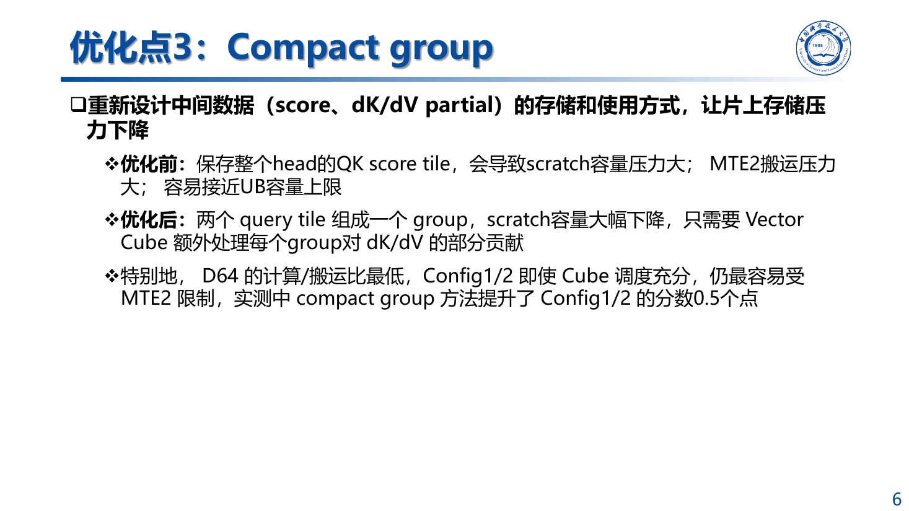
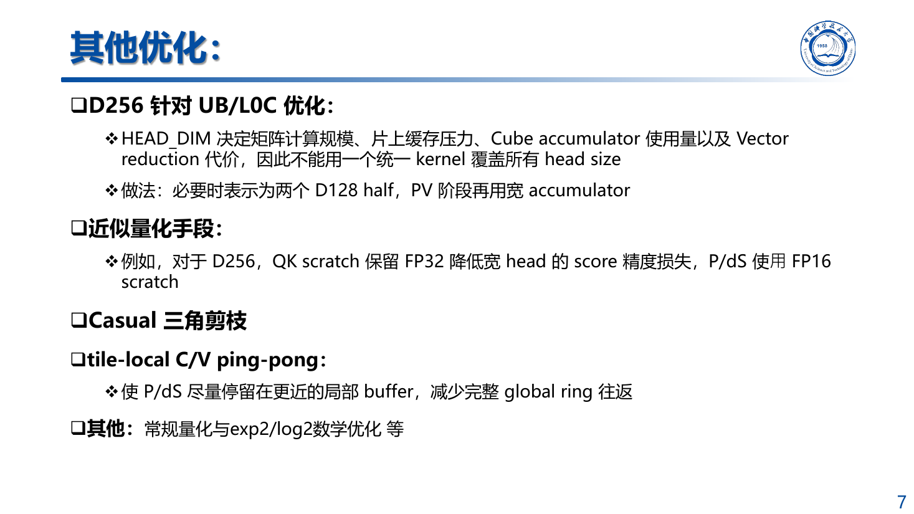

2026 年，我们参加了全国大学生计算机系统能力大赛编译系统设计赛（华为毕昇杯）。
赛题围绕 FlashAttention 算子展开：初赛主要优化 Forward，决赛主要优化 Backward。

我们基于 Triton-Ascend 完成算子实现，并针对昇腾 Cube 与 Vector 分离的硬件结构设计
细粒度 CV 流水，使 Cube 利用率达到 90%+。最终，我们获得全国一等奖。这个赛道共有
115 支队伍报名，最终只有 5 支队伍获得一等奖。

下面按我们实际做优化的顺序整理。

## 一、先从 FlashAttention Forward 说起

标准 Attention 的前向计算是：

```text
S = Q @ K^T * scale
P = softmax(S)
O = P @ V
```

直接实现会生成完整的 `N × N` 分数矩阵和概率矩阵。序列一长，中间矩阵本身就很大，
而且还要在计算单元和 Global Memory 之间来回搬。

FlashAttention 的处理方式是把 Q、K、V 切成 tile。一个 Q tile 留在片上，依次遍历
K/V tile，只计算当前小块的 score。Softmax 也不必等完整一行算完再做，而是在线维护：

- `m_i`：已经遍历部分的逐行最大值；
- `l_i`：当前 Softmax 分母；
- `acc`：尚未归一化的 `P @ V` 累加结果。

新 tile 到来时，如果行最大值发生变化，就缩放旧的 `l_i` 和 `acc`，再合并当前 tile。
这样整个过程中只保留一个 `BLOCK_M × BLOCK_N` 的 score，完整的 `S` 和 `P` 都不会
写回 Global Memory。

初赛的 Forward 版本还做了几项常规但有效的处理：

- 使用 `exp2`，把 scale 乘上 `log2(e)`；
- `m_i`、`l_i` 和输出 accumulator 使用 FP32，送进 Cube 的 `P` 转成 FP16；
- causal 模式直接缩短 key tile 的循环上界，只在对角 tile 内做精确 mask；
- D256 拆成两个 D128 分片，避免一次保留过宽的 accumulator。

Forward 的实现相对清楚：一个 Q tile 扫过 K/V，最后只写一次 O。到了 Backward，
数据的归属关系就复杂多了。

## 二、Backward 难在三个梯度的归约方式不同

FlashAttention Backward 可以写成：

```text
Delta = rowsum(O * dO)
P     = recompute_softmax(Q @ K^T * scale)
dP    = dO @ V^T
dS    = scale * P * (dP - Delta)
dQ   += dS @ K
dK   += dS^T @ Q
dV   += P^T @ dO
```

我们仍然不保存前向的完整概率矩阵，而是在反向里重新计算 `P`。额外计算是可以接受的，
因为省掉了巨大的中间矩阵读写。

麻烦主要出在 `dQ/dK/dV` 的累加方向不同。`dQ` 可以由当前 query tile 自己完成；
一个 `dK` 或 `dV` tile 却要收集多个 query tile 的贡献。如果直接把小块分给很多 program，
最后就要用 atomic、跨 program reduction，或者分配很大的 partial workspace。

我们早期试过保存全量 `P/dS`。大配置中，单个 `B × H × N²` scratch 就接近 2 GiB，
同时保存两份约 4 GiB，D256 很快就 OOM 了。这条路也会产生大量 MTE2 搬运，所以后来
完全放弃。

后面的实现遵守三个原则：

1. `P` 在反向过程中重算，不保存完整注意力矩阵；
2. 每个梯度 tile 尽量只有一个 program 负责写回；
3. scratch 按物理 core 分配和复用，不随全部 head 的 `N²` 一起增长。

## 三、昇腾上的 Cube 和 Vector 需要分别安排

昇腾的 Cube 和 Vector 是分开的。Cube 适合做 QK、dP 和梯度 GEMM，Vector 更适合
Softmax、mask、Delta 修正与 reduction。比赛机器上的 Cube、Vector 资源配比约为
`2:1`，两边的工作量如果没有安排好，就会有一侧提前做完，等另一侧追上来。



最初的执行顺序基本是串行的：

```text
Cube   计算 QK 和 dP
Vector 生成 P 和 dS
Cube   计算 dQ、dK、dV
```

每一段单独看都没有明显问题，但 Profile 里能看到不少等待。Cube 算完 score 后停下来等
Vector，Vector 做完 `P/dS`，Cube 才能继续。我们后面大部分优化都在处理这段等待时间。

## 四、CV Pipeline：让 Cube 和 Vector 同时工作

最后使用的是跨 head 的 producer-consumer pipeline。Cube 为当前 head 计算 score 时，
Vector 可以处理前一个 head 的 `P/dS`；等 Vector 处理完，Cube 再接着计算这个 head 的
梯度 GEMM。

为了防止前后两批数据互相覆盖，我们准备了两个 scratch slot，交替存放中间结果：

```text
Cube   : score(head n, slot 0) -> score(head n+20, slot 1)
Vector :                        -> P/dS(head n, slot 0)
Cube   :                                               -> grad(head n, slot 0)
```

`core_mode` 用来区分 Cube 和 Vector 的工作域，不同 `EventID` 的 `Set/Wait` 负责同步：

- Cube 写完 score，通知 Vector 可以读取；
- Vector 写完 `P/dS`，通知 Cube 可以开始梯度计算；
- Cube 消费完成，这个 slot 才能在下一轮重新使用。

这部分最容易出现的是偶发错误。少一个等待，slot 可能在消费完成前被覆盖；多一个等待，
流水又退化成串行。我们用事件把依赖拆开后，Softmax 和 reduction 的时间可以藏在相邻
head 的 Cube 计算后面。



## 五、Persistent Program：20 个 program 处理 1024 个 head

如果按照一个 head 对应一个 program 的方式执行，`Z=128、H=8` 时会启动 1024 个
program。调度次数很多，每个 program 还要准备自己的 scratch，core 之间的负载也不够
稳定。

比赛使用的 Ascend 910B3 上有 20 个物理 Cube core，所以我们只启动 20 个 program。
每个 program 以固定步长领取 head，最终处理 51 或 52 个。处理完一个 head 后不用退出，
而是继续下一个，scratch 也可以直接复用。

这种分配方式还有一个好处：一个 program 可以负责一个 head 内完整的 `dQ/dK/dV`
生成过程，每个梯度 tile 只写一次，不需要再让多个 program 对同一输出做 atomic 或额外
归约。



## 六、Compact Group：只保存眼前要用的中间结果

Persistent Program 解决了 program 数量和全量 workspace 的问题，但 D64/D128 的
non-causal 配置仍然很吃搬运。它们的计算强度不高，QK score、`P/dS` 和 partial 在
Global Memory 与片上缓存之间多走一遍，MTE2 占比就会明显上升。

一开始，我们为一个 head 保留较大范围的 QK score。后来改成两个 query tile 组成一个
group，只让当前 group 的 score 和 `dK/dV partial` 保持活跃。一个 group 算完并归约后，
对应空间马上复用给下一组。

Compact Group 减少了 scratch 容量和中间结果的存活时间，代价是 Vector 和 Cube 要
多处理一层 group 内的 partial。对 D64 这类带宽更紧张的配置，这个交换是划算的，
Config 1/2 的线上总分因此又提高了约 0.5 分。



## 七、D64、D128 和 D256 分开处理

我们一度希望用一个 kernel 覆盖所有 `HEAD_DIM`，实际效果并不好。维度变化后，Cube
计算量、accumulator 大小、UB/L0C 压力和 Vector reduction 成本都会一起变化。

### D64

D64 的计算/搬运比最低，non-causal 还要处理完整 `N²` 区域。它的主要问题不是 Cube
算得慢，而是数据搬得太多。Compact Group、Delta 融合、K tile 复用和 scratch alias
在这条路径上更有效。

### D128

D128 更容易让 Cube 忙起来，但 `dK/dV` accumulator 也更大。部分 non-causal 配置把
dK 和 dV 合到同一次 query-tile 扫描里，少读一次 `P/dS/Q/dO`；资源更紧张的 causal
配置仍然分两遍做。

### D256

D256 直接使用 256 宽的大 accumulator 很容易碰到 UB/L0C 和编译器展开限制。我们的
处理方式是把 Q/K/V 和 preprocess reduction 拆成两个 D128 half，QK 阶段合并两段
点积，后续再完成宽维度累加。

D256 的 score 对精度更敏感，所以 QK scratch 保留 FP32，`P/dS` 使用 FP16 控制容量。
它也没有照搬 D64/D128 的跨 head 双大槽，而是使用单 head slot 和 query-tile 级事件
交替，避免同时占用多个宽 accumulator。



## 八、Causal 不是只加一个 Mask

causal Attention 的上三角区域不参与计算。假设 score 被分成 8 × 8 个 tile，
non-causal 需要处理 64 个，而 causal 只需要：

```text
1 + 2 + ... + 8 = 36
```

循环只走下三角后，可以直接少算 `43.75%` 的 tile。QK、dP、dQ、dK 和 dV 都会一起
减少。如果只是算完整矩阵后再 mask，省不到这些 GEMM。

我们还让 `qk -> P`、`dP -> dS` 复用同一块 scratch，因为前一个值被消费后就不再需要。
部分路径使用 tile-local C/V ping-pong，让 `P/dS` 尽量留在较近的 buffer，少绕一次
global ring。

## 九、哪些尝试最后没有留下

优化过程中做过不少看起来合理、实际没有收益的实验：

- 全量 `P/dS workspace` 在 D256 上直接 OOM；
- 10 或 16 个 core 都比 20 个 core 慢；
- C1 使用 BN256、BM512 时出现 UB/Cbuf 溢出、编译失败或性能下降；
- 更激进的 FP16 accumulator 没有稳定变快，反而增加精度风险；
- 一些 compiler flag 能让单个 kernel 少几十微秒，但端到端时间没有变化；
- 单纯继续放大 tile，在 MTE2 已经成为瓶颈时基本没有帮助。

所以每个候选版本都要先检查 FP16/BF16、causal/non-causal 的正确性，再看 Cube MAC、
CV 工作比例、同步等待、MTE2 和端到端耗时。只看某一次 kernel 时间，很容易把测量
波动当成优化。

## 十、最后

回头看，提升最大的一步不是换了某组 `BLOCK_M/BLOCK_N`，而是把执行方式改成了适合
昇腾的样子：20 个 program 持续处理 head，Cube 和 Vector 用双槽事件流水衔接，
Compact Group 控制中间结果的存活范围，causal 场景则直接跳过不需要计算的 tile。

## 参考资料

- Tri Dao 等，*FlashAttention: Fast and Memory-Efficient Exact Attention with IO-Awareness*，NeurIPS 2022。
- Tri Dao，*FlashAttention-2: Faster Attention with Better Parallelism and Work Partitioning*，ICLR 2024。
- OpenAI Triton fused attention tutorial。
- Triton-Ascend 教程、AscendNPU IR 文档与 Triton-Ascend 仓库。
- 项目中的 Forward、Backward 源码、技术报告、Profile 和消融记录。
