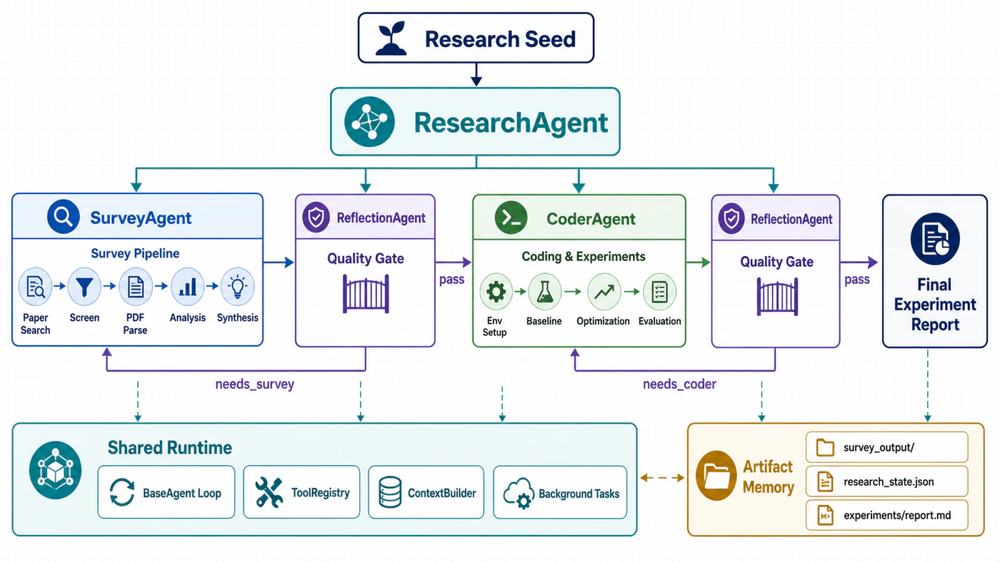
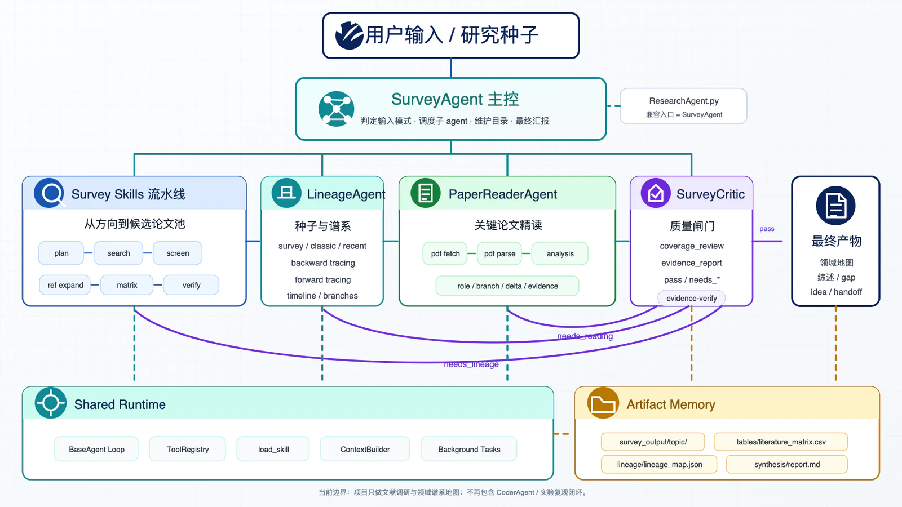

这是一套持续演化的系统：它覆盖文献调研、代码实验和反思迭代；我主要负责文献调研部分，该部分单独深化成了一套面向“领域谱系地图”的 SurveyAgent 系统。

github仓库：https://github.com/yaleyoou/Auto-Sci-Find-MutiAgent

## 先说明两个版本


| 版本       | 目标                                 | 主要 Agent                                                     |
| ---------- | ------------------------------------ | -------------------------------------------------------------- |
| 科研闭环v1 | 从研究问题推进到可验证的实验报告     | ResearchAgent、SurveyAgent、ReflectionAgent、CoderAgent        |
| 调研系统v2 | 从研究方向或种子论文构建领域谱系地图 | SurveyAgent、LineageAgent、PaperReaderAgent、SurveyCriticAgent |

两版共用 BaseAgent、工具注册、Skill 加载、上下文管理和文件化产物等基础设施。比赛名次和完整 Multi-Agent 系统是团队成果；我主要负责文献调研链路及其后续演化，包括查询规划、检索筛选、引用扩展、论文解析与分析、文献矩阵和调研质量闭环。后续已将自己负责的文献调研部分整合到nanobot形成产品。

## 为什么要做这套系统

大模型可以帮助搜索论文、读代码和写实验脚本，但真正的科研任务很少能在一个 prompt 里结束。

一个研究问题通常要经历这样的过程：先拆清楚问题，再查已有工作；从文献中找出可复现的 baseline 和可能的 gap；搭环境、跑实验、读取结果；如果结果不支持原来的判断，还要回到调研或实验设计阶段重新迭代。任何一环的信息不完整，后面的工作都可能建立在错误假设上。

我们探索的核心问题因此不是“怎样让一个 Agent 更聪明”，而是：

> 能否把任务拆解、策略规划、调研分析、代码实验、结果校验和反思迭代串成一条可执行、可追踪、可回退的自动化科研闭环？

这套框架后来被用于 AI4S 智能体 CNS 挑战赛中的蛋白质构象系综生成任务。与输出一个静态结构不同，构象系综生成关心的是一组可能构象及其分布，方法选择、实验设置和评价方式之间有很强的依赖关系。Agent 不仅要执行预设流程，还要根据实验反馈重新判断策略。据团队参赛记录，我们以初赛第一名进入复赛。

## 整体架构：交接比角色数量重要



```text
Research Seed
  -> SurveyAgent
  -> ReflectionAgent
  -> CoderAgent
  -> ReflectionAgent
  -> Final Experiment Report
```

最上层的 ResearchAgent 是调度者。它不亲自完成所有工作，而是负责拆解任务、选择下一步策略、把上游产物交给合适的子 Agent，并根据质量检查结果决定继续、回退还是结束。


| Agent           | 主要职责                                                           | 关键产物          |
| --------------- | ------------------------------------------------------------------ | ----------------- |
| SurveyAgent     | 检索、筛选、解析和精读论文，提炼谱系、baseline、数据集、指标与 gap | survey report     |
| ReflectionAgent | 检查调研覆盖、实验充分性和创新性，决定通过或打回                   | quality state     |
| CoderAgent      | 搭建环境、复现 baseline、执行优化与对照实验、记录结果              | experiment report |
| ResearchAgent   | 维护全局任务状态，完成跨 Agent 调度和最终汇总                      | state / handoff   |

系统要求子 Agent 通过文件交接证据和状态，而不是只返回一段自然语言摘要。ResearchAgent 在做关键判断时，也要重新读取报告、日志和结果文件。

这解决了一个很实际的问题：对话会变长、上下文会被压缩、子 Agent 的上下文彼此隔离，但文件不会因为一次对话结束而消失。Markdown、JSON、CSV、实验日志和模型输出不是附属品，而是系统的长期记忆。

## 一次任务怎样从头跑到尾

### 1. 定义 Research Seed

系统先把用户的想法整理成 Research Seed，也就是准备继续验证的初始研究问题、使用场景、约束和成功标准。输入可以是一个宽泛方向、一篇种子论文，也可以是竞赛给定的任务。

如果输入仍然模糊，ResearchAgent 只提出必要的澄清问题，而不是立刻开始大规模搜索或训练。

### 2. SurveyAgent 建立证据底座

SurveyAgent 从研究问题出发，完成检索规划、论文搜索、筛选、PDF 下载与解析、关键论文精读和综合报告。报告不仅回答“这个方向有哪些论文”，还要给出后续实验真正需要的信息：

- 推荐复现的 baseline；
- 数据集、指标和实验协议；
- 论文方法的关键差异；
- 已知失败场景与可能的优化方向；
- 哪些判断来自论文证据，哪些只是待验证推断。

### 3. 第一次 Reflection：调研够不够支撑实验

ReflectionAgent 作为质量门检查：关键词是否只覆盖了单一叫法，是否遗漏关键 benchmark，指标是否明确，推荐的 baseline 是否真的可运行。

如果返回 `needs_survey`，ResearchAgent 会把具体补搜 query、缺失数据集或待核查指标交回 SurveyAgent。只有调研报告能够形成清晰的实验交接，流程才进入下一阶段。

### 4. 收敛 Hypothesis 和最小实验协议

ResearchAgent 基于调研材料提炼当前 hypothesis，明确要验证什么、选哪个 baseline、使用什么指标，以及怎样用最小成本判断路线是否成立。实验目标必须能追溯到上游证据，实验结果也必须有可能支持或推翻当前假设。

### 5. CoderAgent 复现和优化

CoderAgent 读取 survey report 和 handoff 后，依次完成环境搭建、代码理解、baseline 复现、profiling、单变量优化和 A/B 对照。训练命令、依赖版本、随机种子、日志、结果和失败原因都会写入实验目录。

长时间训练使用后台任务执行。主 Agent 可以继续读代码、检查日志或安排其他工作，任务完成后再把结果注入后续推理，避免一次同步调用超时就让整个闭环中断。

### 6. 第二次 Reflection：结果是否站得住

实验后的 ReflectionAgent 检查 baseline 是否复现、对照是否公平、数据量是否足够、优化是否只是偶然波动，以及当前结果能否支撑所谓“创新点”。

如果返回 `needs_coder`，系统会补随机种子、补消融、做错误分析或重新跑对照；如果实验从根本上不支持 hypothesis，则回到调研或问题定义阶段，而不是只挑好看的结果写进报告。

### 7. 形成 Final Experiment Report

最终产物不是自动生成的论文，而是一份可审计的实验报告。它包含研究问题、上游证据、实现环境、实验设置、结果表格、失败案例、结论边界和下一步工作。

## 我负责的文献调研链路

文献调研看起来像“搜索加总结”，但如果希望它能驱动实验，至少要解决三个问题：召回是否足够、筛选是否可靠、结论是否可追溯。

### 查询规划

`plan_queries` 不直接搜索，而是把研究主题拆成多组 query。除了核心方法名，还会覆盖任务定义、数据集、benchmark、系统或模型名、作者群、相邻术语和年份窗口。

这样做是为了避免只围绕用户最初使用的一个词打转。前沿论文的标题未必包含表层关键词，真正重要的工作可能藏在某个系统名、benchmark 或研究团队的后续论文里。

### 多源搜索

搜索层可以按配置组合多个学术与 Web 来源，统一论文元数据并去重。每条结果保留来源 query 和 source status，使后续能够回答“这篇论文为什么会进入候选池”。

不同来源对预印本、引用关系、元数据和网页线索的覆盖不同。只有保留来源信息，后面才能判断缺口是领域本身没有结果，还是某个接口没有召回。

### 两阶段筛选

候选池先经过一轮可解释的启发式粗筛，综合题名和摘要词汇重合、年份、引用、venue、来源共识和 PDF 可用性；随后再由 LLM 对小批论文做语义相关性判断。

这种组合减少了把所有论文都交给 LLM 打分的调用成本，也降低了经典论文仅因年份较早被过滤，或新工作因引用尚少被忽略的风险。

### 从关键词搜索走向谱系追踪

关键词检索可以找到“名字像”的论文，却不一定找得到真正定义问题、改变路线或被后来工作反复继承的节点。

因此系统从筛选后的高相关论文出发，沿参考文献向后追溯，再沿引用关系追踪后续工作，输出时间线、方法分支以及 `introduces / extends / critiques / benchmarks / applies` 等论文关系。

调研目标随之从“搜到一批相关论文”变成了“建立一张核心谱系地图”。系统会区分：

```text
origin / concept / survey / method / benchmark
application / recent_variant / side_branch / noise
```

### PDF 解析与关键论文精读

下载预算优先分配给高优先级论文，并把下载成功、跳过和失败记录在 manifest 中。PDF 解析优先转成 Markdown；解析全文和论文精读是两个不同阶段，不能把“已经转成文本”当成“已经理解”。

PaperReaderAgent 聚焦主干节点。每篇笔记不仅总结方法，还要回答它在谱系中的角色、相比前作的关键变化、数据集和指标、主要证据、局限、复现线索，以及是否暴露了新的补搜目标。

### 文献矩阵

整个调研系统的中心数据结构是 `literature_matrix.csv`。一行对应一篇论文，包含题名、作者、年份、标识符、引用数、谱系角色、方法分支、贡献、相对前作的变化、数据集、指标、复现性、阅读优先级、用途和证据状态。

它既是给人看的领域地图，也是后续 Agent 的结构化输入。SurveyAgent 可以据此选择必须精读的论文，Critic 可以检查高优先级论文是否缺笔记，实验 Agent 也可以从中提取 baseline 和指标。

### 质量闸门

当前版本使用两层检查：

- `evidence-verify` 检查文件、标识符、年份覆盖、精读产物和生成时间；
- SurveyCriticAgent 检查主线是否完整、分支是否平衡，以及 gap 和 idea 是否真的有论文证据。

状态可能是 `pass`、`needs_search`、`needs_reading`、`needs_metadata` 或 `preliminary`。只要仍有会改变主线的 blocking gap 且循环预算未用完，SurveyAgent 就要把 Critic 的建议转换成下一轮可执行任务。

> 反思不是报告末尾的一段自我批评，而是会改变控制流的程序状态。

## 从科研全闭环到文献调研专精版



项目的演化大致经历了以下阶段：


| 时间          | 主要变化                                                      |
| ------------- | ------------------------------------------------------------- |
| 2026.06.06    | 完成基础 LLM tool-use loop、工具抽象和 Skill 加载机制         |
| 2026.06.07    | 打通检索、筛选、下载、解析、精读、综合流程，并加入 CoderAgent |
| 2026.06.08    | 将专职 Agent 暴露成主控工具，加入 ReflectionAgent 和后台任务  |
| 2026.06.09-10 | 增加持久任务图、handoff、上下文压缩、大结果落盘和分页读文件   |
| 2026.06.11    | 修复后台任务提前结束和空返回，加入引用扩展与二次筛选          |
| 2026.06.30+   | 收敛为文献调研系统，加入谱系、精读、文献矩阵和证据闸门        |

参赛版本强调 `Survey -> Reflection -> Coder -> Reflection` 的完整实验闭环；赛后版本则刻意移除实验 Agent，把范围收窄为“从研究方向或种子论文构建可复用的领域地图”。

## 支撑长任务的工程设计

### 共享 BaseAgent

所有 Agent 复用同一个 BaseAgent：维护消息历史，调用 LLM，执行 tool use，把 tool result 写回上下文，直到模型给出最终答案。专职 Agent 主要通过 system prompt、可用 Skills 和产物约束定义职责。

### Skill 按需加载

工具注册表只把 Skill 的名称和简介放入 system prompt。Agent 真正需要某项能力时，再读取完整说明。这样可以在保持扩展性的同时控制 prompt 体积。

### 持久状态比对话记忆可靠

短期计划由 Todo 管理，跨阶段任务写入持久状态。每个任务记录执行 Agent、状态、输入、输出、依赖、阻塞原因和下一步动作。handoff 文件保存当前研究种子、hypothesis、baseline、最新反思结论和实验结果。

### 上下文压缩必须可审计

搜索结果、论文全文和实验日志很容易撑爆上下文。运行时会把完整 transcript 与超大工具输出落盘，再用连续性摘要和文件路径替换历史。这样既控制上下文长度，也没有直接丢掉原始信息。

### 失败状态必须是一等公民

开发过程中遇到过几类典型问题：后台任务还没结束，Agent 却已经返回最终答案；子 Agent 没有文本；工具输出过长；质量检查指出缺口后，主控只把它写成建议，却没有继续执行。

对应修复逐渐形成了运行时规则：只要还有后台任务，主循环就不能结束；空返回会触发恢复提示；大结果自动落盘；Critic 的 blocking gap 会被解析成下一轮任务队列。

## 怎样判断调研真的完成了

生成了 report 并不等于任务完成。我更愿意用下面几组问题判断调研是否收敛：

- 起源论文、关键概念、主要方法分支和近期代表作是否连成主线？
- 新增关键词和引用是否还会不断改变主线，还是只增加旁支？
- 高优先级论文是否真的有全文精读笔记？
- gap 和 idea 能否回指到论文、Web 或代码证据？
- 对“最新”“SOTA”的判断是否实际检索了当前年份？
- 元数据、URL 和实验指标是否可追溯？

只有这些问题通过，系统才有资格把产物称为 final。

## 这次实践带给我的认识

### Multi-Agent 的价值来自约束

如果多个 Agent 只是轮流输出文字，系统只会变得更慢、更贵。角色划分必须对应不同的工具权限、输入产物、输出格式和通过条件。ReflectionAgent 尤其不能只做“总结与建议”，它必须拥有打回流程的能力。

### 科研自动化的核心是证据流

从论文到 hypothesis，从 hypothesis 到实验，从实验到结论，每一步都要保留来源。自然语言负责解释，JSON、CSV、日志和报告负责承载状态。没有这条证据流，自动化越快，放大错误的速度也越快。

### Agent 要能诚实地停在 preliminary

自动化系统最危险的不是报错，而是证据不足时仍然生成一个完整、肯定的答案。把 `needs_search`、`needs_reading` 和 `preliminary` 设计成明确状态，往往比继续优化 prompt 更重要。

## 当前边界与下一步

文献召回受搜索接口覆盖和元数据质量影响，PDF 解析可能丢失公式或表格，LLM 对论文关系的判断也必须由引用或正文证据约束。当前调研版本不再执行代码实验，因此完整竞赛闭环需要重新接入实验 Agent。

下一步最值得继续做三件事：

1. 建立标准化评测集，量化搜索召回、谱系完整性、精读准确性和 gap 可追溯性；
2. 加强论文实体消歧与引用图构建，减少标题变体、预印本和正式版本造成的重复与断链；
3. 重新打通“文献证据 → 实验协议 → 结果 → 反向补搜”，同时保留证据闸门和 preliminary 机制。

回看这个项目，我最看重的不是“做了几个 Agent”，而是逐渐把一个模糊的科研过程变成了可执行的状态机：每个阶段有输入、有产物、有检查条件，也有失败后的回退路径。
